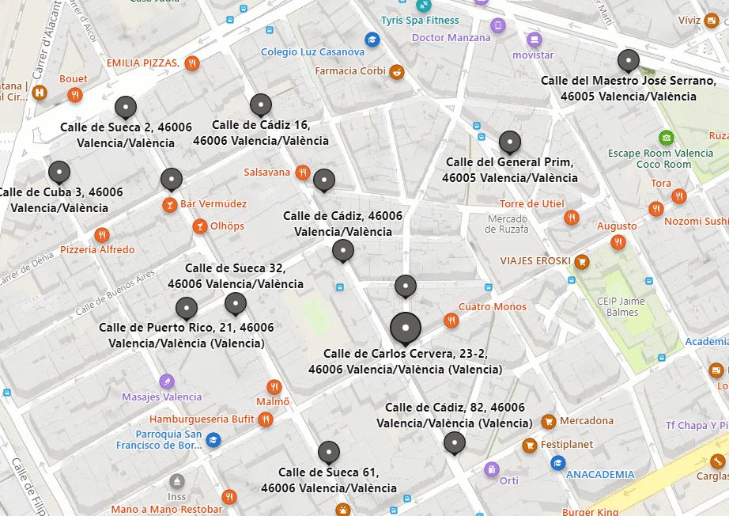

```{r setup, cache = F, echo = F, message = F, warning = F, tidy = F}


# CONFIGURACIÓN GENERAL
library(knitr)
options(width = 100)
rm(list=ls())

# Opciones generales de los chucks. Se utilizarán salvo cambios en el chunk
opts_chunk$set(echo=T, message = F, error = F, warning = F, comment = NA, fig.align = 'center', dpi = 200, tidy = F, cache.path = '.cache/', fig.path = './figura/')

# Opciones generales de dígitos cuando se incluyen tablas
#options(xtable.type = 'html')
knit_hooks$set(inline = function(x) {
  
  if(is.numeric(x)) {
    round(x, getOption('digits'))
  } else {
    paste(as.character(x), collapse = ', ')
  }
})
```

# Instalación automática de paquetes


```{r echo = F, include = F}

# Especificamos las librerías necesarias en esta lista

packages = c("tidyverse","knitr",'readr','lubridate','dplyr','tidyr', 'ggplot2', 'GGally', 'car','e1071', 'ggridges')

#use this function to check if each package is on the local machine
#if a package is installed, it will be loaded
#if any are not, the missing package(s) will be installed and loaded
package.check <- lapply(packages, FUN = function(x) {
  if (!require(x, character.only = TRUE)) {
    install.packages(x, dependencies = TRUE,repos='http://cran.rediris.es')
  }
  library(x, character.only = TRUE)
})

#verify they are loaded
search()

```


# Introducción del trabajo

El objetivo de esta *tarea/trabajo/práctica* es realizar un estudio sobre los diferentes niveles sonoros captados por algunos detectores de ruido situados en varias calles del barrio de Rufaza (Valencia). Para ello, hemos descargado los datos de la página "https://www.valencia.es/dadesobertes/es/data/?groups=medio-ambiente" de los detectores ubicados en las siguientes calles:

Sueca-Denia, Cádiz 3, Cádiz 16, Cuba 3, Sueca 2, Sueca 32, Sueca 61, Carles, Cervera-Chaflán Reina Doña María, Carles Cervera 34, José Serrano-Salvador Abril, Vivons-Cádiz, Puerto Rico 21, Doctor Serrano 21, General Prim-Chaflán Donoso Cortés


# Importación de los datos

Los ficheros ya están descargados en una carpeta llamada 'data'. A partir de la librería 'readr' los importaremos a nuestro entorno de trabajo. Además vamos a aprovechar este paso para añadirle a cada uno de los dataframe una columna llamada 'calle' que indique la calle de la que proviene cada obervación. Esto nos será muy útil más adelante


```{r}
library(readr)
cadiz3 <- read_csv("data/cadiz3.csv", col_types = cols
                   (dateObserved = col_date(format = "%Y-%m-%d")))
cadiz3 <- cadiz3 %>% mutate(calle = "cadiz3")
cadiz16 <- read_csv("data/cadiz16.csv", col_types = cols
                    (dateObserved = col_date(format = "%Y-%m-%d")))
cadiz16 <- cadiz16 %>% mutate(calle = "cadiz16")
carles34 <- read_csv("data/carles34.csv", col_types = cols
                     (dateObserved = col_date(format = "%Y-%m-%d")))
carles34 <- carles34 %>% mutate(calle = "carles34")
cuba3 <- read_csv("data/cuba3.csv", col_types = cols
                  (dateObserved = col_date(format = "%Y-%m-%d")))
cuba3 <- cuba3 %>% mutate(calle = "cuba3")
doctor_serrano <- read_csv("data/doctor_serrano.csv", col_types = cols
                           (dateObserved = col_date(format = "%Y-%m-%d")))
doctor_serrano <- doctor_serrano %>% mutate(calle = "doctor_serrano")
general_prim <- read_csv("data/general_prim.csv", col_types = cols
                         (dateObserved = col_date(format = "%Y-%m-%d")))
general_prim <- general_prim %>% mutate(calle = "general_prim")
maestro_jose <- read_csv("data/maestro_jose.csv", col_types = cols
                         (dateObserved = col_date(format = "%Y-%m-%d")))
maestro_jose <- maestro_jose %>% mutate(calle = "maestro_jose")
puerto21 <- read_csv("data/puerto21.csv", col_types = cols
                     (dateObserved = col_date(format = "%Y-%m-%d")))
puerto21 <- puerto21 %>% mutate(calle = "puerto21")
reina_maria <- read_csv("data/reina_maria.csv", col_types = cols
                        (dateObserved = col_date(format = "%Y-%m-%d")))
reina_maria <- reina_maria %>% mutate(calle = "reina_maria")
sueca2 <- read_csv("data/sueca2.csv", col_types = cols
                   (dateObserved = col_date(format = "%Y-%m-%d")))
sueca2 <- sueca2 %>% mutate(calle = "sueca2")
sueca32 <- read_csv("data/sueca32.csv", col_types = cols
                    (dateObserved = col_date(format = "%Y-%m-%d")))
sueca32 <- sueca32 %>% mutate(calle = "sueca32")
sueca61 <- read_csv("data/sueca61.csv", col_types = cols
                    (dateObserved = col_date(format = "%Y-%m-%d")))
sueca61 <- sueca61 %>% mutate(calle = "sueca61")
sueca_denia <- read_csv("data/sueca-denia.csv", col_types = cols
                        (dateObserved = col_date(format = "%Y-%m-%d")))
sueca_denia <- sueca_denia %>% mutate(calle = "sueca_denia")
vivons_cadiz <- read_csv("data/vivons_cadiz.csv", col_types = cols
                         (dateObserved = col_date(format = "%Y-%m-%d")))
vivons_cadiz <- vivons_cadiz %>% mutate(calle = "vivons_cadiz")


```

# Unión de los datos en un solo dataframe

Ahora vamos a usar la función bind_rows de la librería 'dplyr' para unir todos los data frames anteriores en uno solo. Esto es posible ya que todos poseen las mismas variables, por tanto, lo que estamos haciendo es unir las observaciones una debajo de otra

```{r}
library(dplyr)
sonido_tidy<-bind_rows(cadiz16, cadiz3, carles34, cuba3, 
                       doctor_serrano, general_prim, maestro_jose, 
                       puerto21, reina_maria, sueca_denia,sueca2, 
                       sueca32, sueca61, vivons_cadiz)

sonido_tidy <- sonido_tidy %>% select(6:12)
head(sonido_tidy)
tail(sonido_tidy)
```


# Tansformación a tidy dataset

## Cambiamos los nombres de las variables

Para poder entender mejor qué información contiene nuestros datos nos hemos fijado en la página web de origen y nos hemos dado cuenta de qué nos proporciona cada variable. Les cambiaremos los nombres para poder trabajar de forma más cómoda:

***NSC*** <- Nivel sonoro continuo (LAeq)

***7-19*** <- Sonido desde las 7 hasta las 19 (LAeq_d)

***SDTN*** <- Sonido día-tarde-noche, es utilizado para determinar la molestia vinculada a la exposición al ruido. (LAeq_den)

***19-23*** <- Sonido 19 hasta las 23 horas. (LAeq_e)

***23-7*** <- Sonido desde las 23 hasta las 7 horas. (LAeq_n)

***Fecha*** <- Fecha de observación (dateObserved)

También haremos un primer resumen estadístico para ver una primera impresión acerca de los datos.


```{r}
variables <- c("NSC", "S7_19", "SDTN", "S19_23", "S23_7",  "Fecha", "CALLE")
names(sonido_tidy) <- variables
summary(sonido_tidy)
```

Como podemos obervar no se encuentran valores perdidos en ninguna variable. Tenemos 5 variables de tipo numérico, una de tipo carácter (que se debe transformar a factor) y otra desconocida (que es de tipo fecha). Estas dos últimas se deben corregir.

## Categoría de las variables

Vamos a cambiar el tipo de variables de Fecha y Calle, La primera será de tipo fecha y la segunda de tipo factor, con tantos niveles como calles tenemos.

```{r}
sonido_tidy$Fecha <- ymd(sonido_tidy$Fecha)
sonido_tidy$CALLE <- as.factor(sonido_tidy$CALLE)
```


## Imputación de los datos

En la observación del summary hemos observado que los datos contienen algunas inconsistencias como es el hecho de que aparecen valores infinitos. Para solucionar este problema y que los estadísticos que realizaremos a posteriori tengan un valor más próximo al real, realizaremos una imputación cambiando el valor inf por el máximo de esa calle para variable.

```{r}
sonido_tidy%>% filter(S19_23 == Inf|S7_19 == Inf) 
```

Ahora como podemos observar los problemas se encuentran en las calles cadiz16 y maestro jose, procedemos a la imputación.

```{r}
maximo <- sonido_tidy %>%
  filter(CALLE == 'cadiz16'& S19_23 != Inf) %>%
  select(S19_23) %>% max()
sonido_tidy$S19_23[sonido_tidy$S19_23==Inf] <- maximo
maximo <- sonido_tidy%>%
  filter(CALLE == 'maestro_jose'& S7_19 != Inf) %>%
  select(S7_19) %>% max()
sonido_tidy$S7_19[sonido_tidy$S7_19==Inf] <- maximo
```

# Análisis exploratorio de los datos

En este apartado vamos a estudiar la estructura interna de los datos.

## Análisis univariante

Vamos a empezar analizando cada una de las variables sonoras en cada calle para ver sobre qué valores se mueve cada una.
```{r}
t1 <- sonido_tidy %>%
  pivot_longer(names_to = "sonido", values_to = "valor", NSC:S23_7)

ggplot(t1, aes(x = CALLE, y = valor, col = CALLE)) + geom_boxplot() + 
  theme(axis.text.x = element_blank(), axis.ticks = element_blank()) +
  facet_wrap(~sonido)

```
Podemos afirmar que los datos están bastante distribuidos. La regla del boxplot determinaría muchos outliers pero estos no deben considerarse como outliers ya que son valores posibles definidos en un intervalo razonable.

Ahora analizaremos si las variables siguen una distribución gaussiana. Para ello vamos a utilizar diferentes tipos de gráficos
```{r}
sonido_tidy %>% select(S7_19,S19_23,S23_7) %>%
  pivot_longer(names_to = 'horas', values_to = 'sonido',S7_19:S23_7) %>%
  group_by(horas) %>%  ggplot(aes(x = sonido)) +
  geom_histogram(fill = "aquamarine", colour = "darkblue", size = .3) +
  scale_y_continuous( name = "Num. Oservaciones" ) +
  scale_x_continuous( name = "Sonido" ) +
  facet_wrap(~horas)

qqPlot(sonido_tidy$S7_19)
qqPlot(sonido_tidy$S19_23)
qqPlot(sonido_tidy$S23_7)

```

Como podemos ver, los datos acerca de las variables sobre las horas no siguen una distribución gaussiana debido a la alta frecuencia de los valores elevados. 

## Análisis bivariante

Vamos a realizar un analisis bivariante de las variables de sonido que se nos han proporcionado. Para ello utilizaremos la funcion ggPairs y ggcorr para poder tener una representación de las relaciones exitentes entre las variables consideradas.

Además de lo mencionado realizaremos un analisis de la correlacion con los métodos de spearman y pearson de las variables que hemos mencionado anteriormentre, para ver el grado que tienen de relacion de una forma lineal y no lineal.

```{r}
sonido_tidy %>% select(NSC:S23_7) %>% ggpairs()

sonido_tidy %>% select(NSC:S23_7) %>% ggcorr()

sonido_tidy %>% select(NSC:S23_7) %>% pairs()

s1 <- sonido_tidy %>% select(NSC:S23_7)
cor(s1, method = "spearman")
cor(s1, method = "pearson")

```

Como ya se podia prever, las variables siguen una distibucion lineal, además de tener un alto grado de relacion, esto es normal ya que estamos tratando sonidos de las calles de un barrio y entre estas no hay mucha distancia por lo que tienen que tener una relacion en el sonido.

# Creación de los estadisticos 

El primer acercamiento que haremos al análsisi más en profundidad es una tabla de estadísticos (cuartil 25, cuartil 75, media, mediana, longitud, desviación estándard, sesgo y kurtosis). Estos nos proporcionarán una primera idea de cómo está distribuida más internamente cada variable.

```{r}
tabla <- sonido_tidy %>% select(NSC:S23_7)  %>%
  pivot_longer(names_to =  'tipo',values_to= 'sonido',NSC:S23_7) %>%
  group_by(tipo) %>% 
  summarise(across(everything(),list(
    mean=~mean(.,na.rm=TRUE),
    length=~length(.),
    q25=~quantile(.,0.25),
    mediana=~quantile(.,0.5),
    q75=~quantile(.,0.75),
    sd=~sd(.,na.rm=TRUE),
    skewness=~skewness(.,na.rm=TRUE),
    kurtosis=~kurtosis(.,na.rm=TRUE)))) 
names(tabla) = c("tipo" ,"mean","length","q25","mediana" , "q75","sd","skewness" ,"kurtosis") 
tabla 

```

La mayoría de ellas siguen valores bastante parecidos, como es lógico, la variable S23_7 (la de la noche) es la que presenta valores más pequeños pero su desviación estándard es la más grande debido al contraste entre las últimas/primeras horas y las horas más "centrales" de la noche. También nos llama la atención que la variable SDTN (sonido día-tarde-noche) es la que toma valores más altos tanto en la media, la mediana como en los cuartiles. Podemos apreciar que el NSC es la que tiene la kurtosis más elevada lo cual nos dice que que la mayoría de los valores están centrados en la media, lo cual tiene mucho sentido ya que es el nivel sonoro continuo.

# Preguntas a resolver

Una vez ya hemos hecho un primer análisis de los datos, sabemos cómo están organizados y distribuidos. Debemos plantearnos las preguntas que queramos resolver para poder obtener un análisis más profundo de los datos.

## Horas

- **¿Cuál es la franja horaria en la que de media hay más ruido?**

```{r}
sonido_tidy %>%
  gather(key = "horario", value = "nivel_sonido", c(S7_19,S19_23,S23_7)) %>%
  group_by(horario) %>%
  summarise(Nivel_sonoro_continuo_medio_maximo = mean(nivel_sonido)) %>%
  filter(Nivel_sonoro_continuo_medio_maximo ==
           max(Nivel_sonoro_continuo_medio_maximo))

sonido_tidy %>%
  gather(key = "horario", value = "nivel_sonido", c(S7_19,S19_23,S23_7)) %>%
  group_by(horario) %>%
  summarise(Nivel_sonoro_continuo_medio_minimo = mean(nivel_sonido)) %>%
  filter(Nivel_sonoro_continuo_medio_minimo ==
           min(Nivel_sonoro_continuo_medio_minimo))
```

*Como era de esperar, la que más ruido proporciona es la de entre las 7 y las 19 y la que menos es la de entre las 23 y las 7.*

## Meses

Vamos a realizar un estudio de las variables por meses, empezaremos asignando a cada observación su mes corresponente

```{r}
meses<- sonido_tidy %>% filter(month(Fecha)== 1) %>% mutate(mes = 'Enero')
meses<- sonido_tidy %>% filter(month(Fecha)== 2) %>% mutate(mes = 'Febrero') %>% union(meses)
meses<- sonido_tidy %>% filter(month(Fecha)== 3) %>% mutate(mes = 'Marzo') %>% union(meses)
meses<- sonido_tidy %>% filter(month(Fecha)== 4) %>% mutate(mes = 'Abril') %>% union(meses)
meses<- sonido_tidy %>% filter(month(Fecha)== 5) %>% mutate(mes = 'Mayo')%>% union(meses)
meses<- sonido_tidy %>% filter(month(Fecha)== 6) %>% mutate(mes = 'Junio')%>% union(meses)
meses<- sonido_tidy %>% filter(month(Fecha)== 7) %>% mutate(mes = 'Julio')%>% union(meses)
meses<- sonido_tidy %>% filter(month(Fecha)== 8) %>% mutate(mes = 'Agosto')%>% union(meses)
meses<- sonido_tidy %>% filter(month(Fecha)== 9) %>% mutate(mes = 'Septiembre')%>% union(meses)
meses<- sonido_tidy %>% filter(month(Fecha)== 10) %>% mutate(mes = 'Octubre')%>% union(meses)
meses<- sonido_tidy %>% filter(month(Fecha)== 11) %>% mutate(mes = 'Noviembre')%>% union(meses)
meses<- sonido_tidy %>% filter(month(Fecha)== 12) %>% mutate(mes = 'Diciembre')%>% union(meses)

```

Tras un primer análisis, podemos ver que no existen valores para el mes de Julio, lo cual provoca que exista una incosistencia y no podamos obtener los mejores resultados.

Empezaremos creando una tabla de estadísticos para cada mes, como hicimos con las horas.

```{r}
tabla <- meses %>% group_by(mes) %>%  select(NSC)  %>%
  summarise(across(everything(),list(
    mean=~mean(.,na.rm=TRUE),
    length=~length(.),
    q25=~quantile(.,0.25),
    mediana=~quantile(.,0.5),
    q75=~quantile(.,0.75),
    sd=~sd(.,na.rm=TRUE),
    skewness=~skewness(.,na.rm=TRUE),
    kurtosis=~kurtosis(.,na.rm=TRUE)))) 
names(tabla) = c("mes" ,"mean","length","q25","mediana" , "q75","sd","skewness" ,"kurtosis") 
tabla 
```

*Inspeccionando la tabla observamos que el que tiene una media más alta es marzo, aspecto que analizaremos más adelante, además de ser el mes con una mayor desviación estándard. También es de destacar, que a diferencia de las franjas horarias aquí no tenemos el mismo número de observaciones para cada mes, exceptuando Julio, Agosto es el mes del que tenemos menos observaciones.*


- **¿Que mes es el más/menos ruidoso?**

Esta pregunta la resolveremos con un gráfico de densidad en el que vamos a representar cada mes con un diagrama y en el eje x el nivel sonoro continuo ya que nos proporciona una media de las franjas horarias.

```{r}
meses %>% ggplot( aes(x = NSC, y = mes, fill = mes)) +
  geom_density_ridges2()
```
Podemos observar que marzo es el mes cuya curva está más plana, lo cuál significa que los datos están más distribuidos y alcanza picos más altos. Además podemos ver que los meses que tienen los valores más centrados son Abril,Junio y Noviembre.

```{r}
meses %>% group_by(mes) %>%
  summarise(bajo = mean(NSC)) %>% 
  filter(bajo == min(bajo))

meses %>% group_by(mes) %>%
  summarise(alto = mean(NSC)) %>% 
  filter(alto == max(alto))
```

*Enero es el mes con menor ruido medio y marzo el mes con mayor ruido medio.*


## Años

Ahora realizaremos el análsis por años, empezaremos asignando el año a cada una de las observaciones

```{r}
sonido_anyo<- sonido_tidy %>% filter(year(Fecha)== 2020) %>% mutate(anyo = '2020')
sonido_anyo<- sonido_tidy %>% filter(year(Fecha)== 2021) %>% mutate(anyo = '2021') %>% union(sonido_anyo)
sonido_anyo<- sonido_tidy %>% filter(year(Fecha)== 2022) %>% mutate(anyo = '2022') %>% union(sonido_anyo)
```

Realizaremos una tabla de estadísticos y un gráfico con el mismo objetivo  del apartado anterior para ver cómo están distriuidos los datos

```{r}
tabla <- sonido_anyo %>% group_by(anyo) %>%  select(NSC)  %>%
  summarise(across(everything(),list(
    mean=~mean(.,na.rm=TRUE),
    length=~length(.),
    q25=~quantile(.,0.25),
    mediana=~quantile(.,0.5),
    q75=~quantile(.,0.75),
    sd=~sd(.,na.rm=TRUE),
    skewness=~skewness(.,na.rm=TRUE),
    kurtosis=~kurtosis(.,na.rm=TRUE)))) 
names(tabla) = c("anyo" ,"mean","length","q25","mediana" , "q75","sd","skewness" ,"kurtosis") 
tabla 

sonido_anyo %>% ggplot( aes(x = NSC, y = anyo,fill=anyo)) +
  geom_density_ridges()
```
De la tabla de estadísticos es muy destacable la kurtosis del año 2021, lo cuál nos indica que sus datos están bastante centrados. Eso puede ser debido a la falta de observaciones para los otros dos años. Hay que anotar que este análisis no es muy óptimo debido a la falta de observaciones para los años 2020 y 2022, es destacable la desviación estandar del 2022 esto se puede atribuir a la vuelta de las fallas y una vuelta a una normalidad pre-covid.

- **¿Cuál fue el año registrado más/menos ruidoso?**

```{r}
sonido_anyo %>% group_by(anyo) %>%
  summarise(bajo = mean(NSC)) %>% 
  filter(bajo == min(bajo))

sonido_anyo %>% group_by(anyo) %>%
  summarise(alto = mean(NSC)) %>% 
  filter(alto == max(alto))
```

*Como podemos oobservar el año registrado más ruidoso es el año 2022. Por otro lado, el año registrado menos ruidoso es el año 2020.*


## Calles

- **¿Cuál es la calle más/menos ruidosa?**
```{r}
sonido_tidy %>% group_by(CALLE) %>%
  summarise(Nivel_sonoro_continuo_medio_maximo = mean(NSC)) %>%
  filter(Nivel_sonoro_continuo_medio_maximo ==
           max(Nivel_sonoro_continuo_medio_maximo))

sonido_tidy %>% group_by(CALLE) %>%
  summarise(Nivel_sonoro_continuo_medio_minimo = mean(NSC)) %>%
  filter(Nivel_sonoro_continuo_medio_minimo ==
           min(Nivel_sonoro_continuo_medio_minimo))
```

*Como podemos observar, la calle mas ruidosa es la calle Cádiz3r otro lado la calle menos ruidosa es la calle general Prim.*


- **¿Cuál es la calle que ha alcanzado el máximo/mínimo nivel de ruido?**

```{r}
sonido_tidy %>%
  group_by(CALLE) %>%
  summarise(Nivel_sonoro_continuo_maximo = max(NSC)) %>%
  filter(Nivel_sonoro_continuo_maximo ==
           max(Nivel_sonoro_continuo_maximo))

sonido_tidy %>%
  group_by(CALLE) %>%
  summarise(Nivel_sonoro_continuo_minimo = min(NSC)) %>%
  filter(Nivel_sonoro_continuo_minimo == 
           min(Nivel_sonoro_continuo_minimo))
```

*Como podemos observar, la calle que ha alcanzado el máximo nivel de ruido es la calle Reina Maria. Por otro lado la calle que ha alcanzado el mínimo nivel de ruido es la calle general Prim.*


- **Las calles que estan cercanas unas de otras tienen una distribucion similar?**

Primero veamos como estan ubicadas en el mapa.


Vamos a realizar un estudio de sensores de ruido dos a dos con los que se encuentren más cerca los unos de los otros.
```{r}
csueca32_puri21<- sonido_tidy %>% filter(CALLE == 'sueca32'| CALLE == 'puerto21' )
csueca2_vivons<- sonido_tidy %>% filter(CALLE == 'sueca2'| CALLE == 'sueca_denia' )
creina_carlos <- sonido_tidy %>% filter(CALLE == 'carles34'| CALLE == 'reina_maria')
cdoctor_cadiz3 <- sonido_tidy %>% filter(CALLE == 'cadiz3'| CALLE == 'doctor_serrano')
```

Primero realizaremos una serie de gráficos de lineas para observar si aumentan o no al mismo tiempo.
```{r}
ggplot(csueca32_puri21, aes(x = Fecha, y = NSC,col='red')) +
  geom_line(aes(xend = lead(Fecha), yend = lead(NSC))) +
  facet_wrap(~CALLE) + theme(axis.text.x = element_blank(),
                             axis.ticks = element_blank())
```
```{r}
ggplot(csueca2_vivons, aes(x = Fecha, y = NSC,col='red')) +
  geom_line(aes(xend = lead(Fecha), yend = lead(NSC))) +
  facet_wrap(~CALLE) + theme(axis.text.x = element_blank(),
                             axis.ticks = element_blank())
```

```{r}
ggplot(creina_carlos, aes(x = Fecha, y = NSC,col='red')) +
  geom_line(aes(xend = lead(Fecha), yend = lead(NSC))) +
  facet_wrap(~CALLE) + theme(axis.text.x = element_blank(),
                             axis.ticks = element_blank())
```

```{r}
ggplot(cdoctor_cadiz3, aes(x = Fecha, y = NSC,col='red')) +
  geom_line(aes(xend = lead(Fecha), yend = lead(NSC))) +
  facet_wrap(~CALLE) + theme(axis.text.x = element_blank(),
                             axis.ticks = element_blank())
```

*Como podemos observar en las gráficas mostradas, en general la mayor parte de las gráficas coinciden excepto en algunos momentos, sin embargo, si que podemos observar como en esos momentos donde en alguna  gráfica el indice de sonido es mayor o da un repunte, en las otras gráficas también se observa dicho resalto o repunte*


## Festvivdad

Para analizar cómo se comportan los diferentes niveles de ruido durante las festividades asignaremos a cada observación a la festividad que pertenece (navidad o fallas) y si no pertenece a ninguna de ellas, lo llamaremos "ordinario".
```{r}
navidad <- sonido_tidy %>%
  select(Fecha) %>%
  filter((month(Fecha) == 12 & day(Fecha) >= 24) |
           (month(Fecha) == 1 & day(Fecha) <= 7))
fallas <- sonido_tidy %>%
  select(Fecha) %>%
  filter((year(Fecha) != 2021 & month(Fecha) == 3 &
            day(Fecha) >= 1 & day(Fecha) <= 22 ) |
           (year(Fecha) == 2021 & month(Fecha) == 9 &
              (day(Fecha) >= 1 | day(Fecha) <= 5)))
sonido_tidy_festividad <- sonido_tidy %>%
  mutate(festividad = c(rep(NA,nrow(sonido_tidy))))

for (i in 1:nrow(sonido_tidy)){
  if (sonido_tidy$Fecha[i] %in% navidad$Fecha){
    sonido_tidy_festividad$festividad[i] <- "navidad"
  } else if(sonido_tidy$Fecha[i] %in% fallas$Fecha){
    sonido_tidy_festividad$festividad[i] <- "fallas"
  }
  else{
    sonido_tidy_festividad$festividad[i] <- "ordinario"
  }
}
calles <- c("cadiz16", "cadiz3", "carles34", "cuba3",
            "doctor_serrano", "general_prim", "maestro_jose",
            "puerto21","reina_maria", "sueca_denia","sueca2",
            "sueca32", "sueca61", "vivons_cadiz")

ggplot(sonido_tidy_festividad, aes(x = Fecha, y = NSC, col = festividad)) +
  geom_line(aes(xend = lead(Fecha), yend = lead(NSC))) +
  facet_wrap(~CALLE) + theme(axis.text.x = element_blank(),
                             axis.ticks = element_blank())

```

- **¿Cómo aumentan los niveles de ruido durante las fallas?**

```{r}
meses %>% filter(mes == "Marzo" & year(Fecha) == 2022) %>% 
  mutate(dia = day(Fecha)) %>% 
  ggplot(aes(x = dia, y = NSC, col = CALLE)) +
  geom_smooth(method = "loess", formula = y ~ x) +
  geom_point() + facet_wrap(~CALLE)
```

*En los dos tipos de gráficos realizados se puede observar claramente como duarnte el periodo de fallas (tanto en general durante los meses como en los días en concreto del mes de marzo) los niveles sonoros aumentan de forma exponencial.*


## Casa / Empresa

- **¿Si quisiésemos comprar una casa o montar una empresa en qué lugar nos interesaría más colocarla?**

Para la casa hemos pensado que es conveniente un lugar con poco ruido ya que puede llegar a ser molesto y para la empresa hemos pensado lo contrario ya que un mayor nivel de ruido puede suponer una mayor afluencia de gente lo cual se transmite en posibles clientes.

```{r}
ggplot(sonido_tidy, aes(x = Fecha, y = NSC,col='blue')) +
  geom_line(aes(xend = lead(Fecha), yend = lead(NSC))) +
  facet_wrap(~CALLE) + theme(axis.text.x = element_blank(),
                             axis.ticks = element_blank())
```

- Lugar de interés para la casa:

*Como se puede observar las mejores calles a mirar un piso serian Sueca 2 ya que usualmente no es muy ruidosa, además otras calles interesantes a ver serian maesto jose, general prim, puerto 21 o incluso cuba 3 son tambien calles con poco ruido, exceptuando algunos picos que pueden estar relacionados con dias festivos como las fallas.*

- Lugar de interés para la empresa:

*Por el contrario si quisiesemos montar una empresa nos interesaria montarla en las que mas ruido tengan ya que esto significara que estaran más transitadas por personas y ayudara a que se vea mas la marca, entonces nos interesaria montar nuestro negocio en calles como caiz 3, cadiz 16 o carles 32.*


